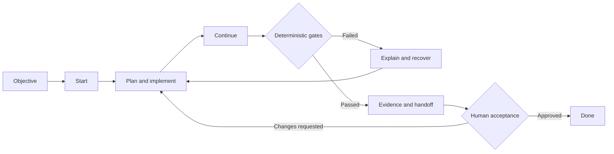
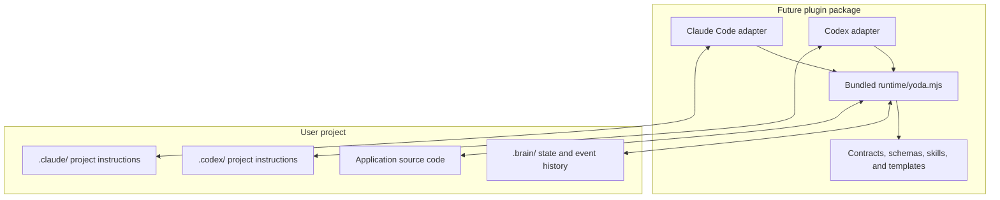

# Mestre Yoda

<p align="center">
  
</p>

> **A deterministic, observable Spec-Driven Development harness for AI coding agents.**

**The model will propose. The runtime will decide. The event log will prove.**

[](#project-status)
[](https://github.com/thiagocorreanet/mestre-yoda/actions/workflows/ci.yml)
[](https://github.com/thiagocorreanet/mestre-yoda/actions/workflows/docs.yml)
[](LICENSE)
[](#contributing)

Mestre Yoda is an open-source **Spec-Driven Development (SDD) harness** designed to make AI-assisted software delivery more reliable, explainable, and auditable.

Instead of trusting an AI coding agent to remember every rule, infer every gate, and declare its own work complete, Mestre Yoda is designed to place a deterministic runtime around the development workflow. In the target architecture, agents propose actions while the harness validates state, enforces policies, records evidence, requires human approval where necessary, and explains why work may or may not continue.

The project is being built for **Claude Code** and **OpenAI Codex**, with a host-neutral core designed to support additional coding agents in the future.

## Project status

> [!IMPORTANT]
> Mestre Yoda is an **experimental rewrite under active development**. There is
> no supported installation method, public distribution, production runtime, or
> usable SDD command today. The checked-in embedded ESM runtime is internal
> foundation infrastructure: it supports only `--help` and `--version` to prove
> the deterministic toolchain and standalone bundle. The project is not ready for production.
> Contract schemas and compatibility checks are available, but they are
> foundation artifacts only. **The harness runtime is not usable yet.**

This repository is intentionally public from the beginning so that its architecture, compatibility decisions, tests, and trade-offs can evolve in the open.

| Area | Status |
| --- | --- |
| Architecture and implementation backlog | Available |
| Go compatibility baseline | [Frozen at v0.6.5](docs/compatibility/go-v3-v0.6.5-baseline.md) |
| Go-to-TypeScript parity inventory | [Complete; parity evidence at 0.00%](docs/compatibility/parity-inventory.md) |
| Universal result contract | [Version 1 published and verified](docs/compatibility/result-contract.md) |
| Plugin, state, and host contracts | [Version 1 schemas and compatibility checks available](docs/compatibility/contract-versioning.md) |
| TypeScript deterministic runtime | [Foundation available](docs/development/toolchain.md) |
| Claude Code integration | Planned |
| OpenAI Codex integration | Planned |
| Legacy project migration | Planned |
| Public beta distribution | Planned |

Follow the [public milestones](https://github.com/thiagocorreanet/mestre-yoda/milestones) or browse the [complete implementation backlog](https://github.com/thiagocorreanet/mestre-yoda/issues).

## Installation

There is no supported installation method for this public rewrite yet. Do not
use installation or marketplace commands from the private Go predecessor: they
refer to a different implementation and distribution boundary.

The planned distribution will embed one self-contained `runtime/yoda.mjs` in
thin Claude Code and Codex plugins. It will not install a global Yoda binary or
project runtime `node_modules`. A supported installation path will be published
only after [version-coherent distributions](https://github.com/thiagocorreanet/mestre-yoda/issues/61)
exist and their install, update, compatibility, rollback, and uninstall flows
pass release gates.

Cloning this repository is currently useful only for contributing to and
validating the rewrite; it does not install Mestre Yoda into an agent host.

## Usage preview — not available yet

The intended agent-driven trail begins with an objective, starts the next valid
workflow, continues through runtime-selected gates, and reaches done only after
evidence and human acceptance agree. Planned operational capabilities include
status, doctor, explain, evidence, handoff, statistics, and budgets.

These operations are architectural preview, not runnable in the current bundle.
The compatibility contract and differential tests must freeze their exact
inputs, outputs, reason codes, and recovery semantics before this README presents
them as usable commands.

## Why Mestre Yoda exists

AI coding agents are powerful, but a prompt alone is not a reliable control system.

Long-running engineering work introduces problems that conversational memory cannot solve consistently:

- requirements drift as context grows;
- agents may skip validation or interpret policies differently;
- approvals can become stale after artifacts change;
- failures often report what happened without explaining why;
- multiple agents can race against the same project state;
- plugin and runtime versions can drift when distributed separately;
- completion claims may not be backed by reproducible evidence.

The Mestre Yoda design addresses these problems with an SDD workflow in which state transitions, gates, approvals, migrations, and recovery rules will be enforced by software rather than left entirely to model behavior.

## Core principles

These principles are target invariants for the rewrite, not claims that the
current smoke bundle implements them.

### Deterministic decisions

The same validated state and inputs should produce the same runtime decision. Language models help reason and propose; they do not silently redefine workflow policy.

### Observable by design

Important decisions become structured events connected to their evidence, artifacts, policies, approvals, and recovery paths.

### Human-controlled delivery

Critical approvals are explicit and bound to the content that was actually reviewed. Changed content invalidates stale authorization.

### Local-first project state

The project-owned `.brain/` state lives inside the project. Host instructions live
in `.claude/` and `.codex/`. The embedded ESM runtime remains owned by the
installed plugin.

### No global Yoda binary

The new runtime is developed in TypeScript and distributed as a self-contained JavaScript ESM bundle inside the plugin. This avoids a separately installed global binary, PATH problems, and runtime/plugin version drift.

### Evidence before completion

A workflow is not complete because an agent says it is complete. Required tests, gates, evidence, handoff information, and human acceptance must agree with the current state.

## How the planned SDD trail will work

Mestre Yoda is designed to follow one agent-driven trail from intent to accepted
delivery:



The future runtime is expected to support the primary trail operations `objective`, `start`, `continue`, and `done`, together with operational capabilities such as `status`, `doctor`, `explain`, `evidence`, `handoff`, `stats`, and `budgets`.

Manual phase jumping is not part of the design. Once implemented, the runtime
will determine which transition is valid from the current state and explain any
blocked transition.

## Architecture

The target Mestre Yoda architecture separates the portable decision engine from
host-specific integration and project-specific state.

The canonical [Yoda Observable Architecture Specification](docs/superpowers/specs/2026-08-06-yoda-observable-architecture-design.md) defines the runtime, state, security, migration, testing, and rollout contracts. Structural choices and their consequences are indexed in the [Architecture Decision Records](docs/adr/README.md), and the required end-to-end architecture trace is recorded in [verification evidence](docs/architecture/verification.md).



The central boundary is deliberate:

```text
future plugin package/
├── runtime/yoda.mjs       # self-contained deterministic runtime
├── adapters/              # host-specific integration
├── skills/                # agent-facing workflows
├── schemas/               # versioned public contracts
└── templates/             # managed project templates

user project/
├── .brain/                # state, events, evidence, and configuration
├── .claude/               # Claude Code project surface
├── .codex/                # Codex project surface
└── ...                    # the user's application
```

The future plugin will contain the motor. The project will contain only the
memory and configuration required for that project.

## Planned capabilities

The implementation backlog covers more than the happy path:

- deterministic workflow state machine and guardrails;
- versioned schemas and stable reason/exit codes;
- universal structured results with actionable recovery;
- append-only event history with a cryptographic hash chain;
- artifact lineage and observed model identity;
- content-bound human approvals;
- universal dry-run plans and decision explanations;
- atomic filesystem transactions and crash recovery;
- concurrency locks, leases, and fencing tokens;
- real Git repository-state classification;
- shadow, warn, and enforce policy modes;
- deterministic replay, integrity audits, and safe repair;
- transactional migration from legacy sibling Brain layouts;
- privacy-reviewed evidence bundles and an offline static dashboard;
- atomic plugin installation, updates, compatibility checks, and rollback.

See the phase epics for the implementation details:

- [Foundation](https://github.com/thiagocorreanet/mestre-yoda/issues/1)
- [Compatibility Contract](https://github.com/thiagocorreanet/mestre-yoda/issues/8)
- [Deterministic Runtime](https://github.com/thiagocorreanet/mestre-yoda/issues/15)
- [SDD Workflow Parity](https://github.com/thiagocorreanet/mestre-yoda/issues/24)
- [Host Integrations](https://github.com/thiagocorreanet/mestre-yoda/issues/34)
- [Migration and Observability](https://github.com/thiagocorreanet/mestre-yoda/issues/40)
- [Quality Campaign](https://github.com/thiagocorreanet/mestre-yoda/issues/48)
- [Public Beta](https://github.com/thiagocorreanet/mestre-yoda/issues/57)
- [Post-1.0 Ideas](https://github.com/thiagocorreanet/mestre-yoda/issues/63)

## Reliability and testing

Mestre Yoda is being designed with the testing discipline expected from conventional production software, extended for agentic workflows.

The planned quality campaign includes:

- unit tests for policies, reducers, schemas, parsers, and reason codes;
- property-based and model-based state-machine tests;
- Go-versus-TypeScript differential compatibility tests;
- golden scenario fixtures and schema contract tests;
- real filesystem and Git integration tests;
- fault injection at atomic transaction boundaries;
- concurrency, lease, and fencing tests;
- security and adversarial input tests;
- black-box tests against the final bundled JavaScript artifact;
- clean installation, update, migration, and rollback tests;
- mutation testing and performance regression budgets;
- native Linux, Windows, and macOS validation;
- Claude Code and Codex contract/E2E tests;
- model-behavior evaluations only where deterministic tests cannot answer the question.

GitHub Actions will separate fast pull-request feedback from broader nightly, compatibility, security, and release campaigns. See [the Actions implementation issue](https://github.com/thiagocorreanet/mestre-yoda/issues/55).

## Failure explanations

Failures should be useful to both humans and agents. The published
[universal result contract](docs/compatibility/result-contract.md) fixes their
machine-readable fields, exit categories, reason policy, evidence references,
safe rendering, and recovery semantics before the runtime consumes it:

```json
{
  "contractVersion": "1.0.0",
  "status": "blocked",
  "exitCode": 3,
  "reasonCode": "trail.gate_divergente",
  "summary": "The supplied gate did not match the active pending gate.",
  "why": [
    "The approval targeted a gate other than the currently pending gate."
  ],
  "evidence": [
    {
      "kind": "approval",
      "ref": ".brain/runs/0001-login/approvals.jsonl",
      "sha256": "3333333333333333333333333333333333333333333333333333333333333333"
    }
  ],
  "stateChanged": false,
  "retryable": true,
  "recovery": "Reload the active pending gate and submit the decision for that exact gate."
}
```

## Roadmap

Development uses four evidence-based maturity stages:

1. **Experimental (current)** — public architecture and foundations; not installable.
2. **Preview** — complete compatible trail and host integrations for evaluation.
3. **Beta** — migration, quality, documentation, and distribution gates passed.
4. **Stable** — representative pilots and every mandatory release gate passed.

See the [Objective maturity gates](ROADMAP.md) for promotion, regression,
rollback, and private Go predecessor retirement criteria. No calendar date,
feature count, or demo can replace the required evidence.

## Development

The repository now provides a pinned Node/npm workspace, strict TypeScript
validation, tests with coverage, and a standalone bundle smoke check. Follow the
[deterministic toolchain guide](docs/development/toolchain.md) to reproduce the
complete validation sequence from a clean checkout.

Run this block in order from a clean checkout using Node.js `24.18.0` and npm
`11.16.0`:

```bash
npm ci
npm run spellcheck
npm run verify
npm run build
npm run package:verify
```

The build creates `dist/plugin/runtime/yoda.mjs`; package verification copies
only that file outside the checkout and exercises help/version. Passing these
commands proves the repository foundation, not SDD product readiness.

- `npm ci` reproduces the exactly locked development dependencies.
- `npm run spellcheck` checks the tracked English Markdown.
- `npm run verify` runs formatting, spelling, lint, typecheck, tests, coverage,
  build, and package verification in order.
- `npm run build` creates the internal standalone smoke bundle.
- `npm run package:verify` validates its inventory, hash, and exact help/version
  behavior outside the checkout; it requires the preceding build.

## Contributing

Mestre Yoda is being developed in the open, and thoughtful contributions are welcome.

Start with the [Contribution guide](CONTRIBUTING.md) and
[work taxonomy](docs/contributing/workflow.md), then use the
[Code of Conduct](CODE_OF_CONDUCT.md), [Governance](GOVERNANCE.md), and
[Support policy](SUPPORT.md) for their respective paths.

The best way to participate today is to:

1. Read the relevant [epic and implementation issues](https://github.com/thiagocorreanet/mestre-yoda/issues).
2. Join an existing design or compatibility discussion before implementing a public contract.
3. Keep changes focused on one issue and include reproducible test evidence.
4. Preserve deterministic behavior and document compatibility, state, migration, and security impact.
5. Use English for source code, comments, tests, fixtures, errors, documentation, issues, commits, and pull requests.
6. Sign every commit under DCO 1.1 and complete the legacy/third-party IP provenance checklist when applicable.

The planned development flow uses short-lived `feature/*`, `fix/*`, `docs/*`, and `refactor/*` branches targeting `developer`. Approved release changes then move from `developer` to the protected `main` branch. This policy is tracked in [issue #60](https://github.com/thiagocorreanet/mestre-yoda/issues/60).

## Security

Read the [Security policy](SECURITY.md) and use GitHub's private
[Report a vulnerability](https://github.com/thiagocorreanet/mestre-yoda/security/advisories/new)
form. Do not publish suspected vulnerabilities, secrets, or exploit details in a
public issue, pull request, discussion, or paste before coordinated disclosure.

## Frequently asked questions

### Is Mestre Yoda ready to install?

No. There is no supported installation method today. This repository contains
the architecture, backlog, governance, deterministic toolchain, and an internal
help/version smoke bundle. Installation instructions will be published only
after they pass against versioned release artifacts.

### Is this just a prompt collection?

No. Skills and prompts will guide agent behavior, but the target architecture
assigns deterministic state transitions, gates, validation, concurrency,
migrations, and recovery to the future runtime.

### Why TypeScript and JavaScript instead of Go?

TypeScript provides a productive development model while a bundled JavaScript runtime can ship inside the plugin. The goal is to remove the separately updated global binary without sacrificing deterministic behavior or testability.

### Will Mestre Yoda modify my source code automatically?

AI coding agents may propose and perform project work under their own host
permissions. The future Mestre Yoda runtime is designed to control and explain
the SDD workflow, validate transitions, preserve evidence, and enforce delivery
gates. Exact permissions and managed paths will be documented before release.

### Where does project state live?

The new architecture keeps project-specific state in `.brain/` inside the project. Host-specific project instructions live in `.claude/` and `.codex/`. The runtime stays inside the installed plugin.

## Acknowledgements

- The private Go Mestre Yoda v3 implementation is the behavioral oracle for
  compatibility work. Its source and prose are not presumed MIT-licensed; every
  migrated artifact remains subject to the repository's provenance policy.
- Claude Code and OpenAI Codex motivate the first host adapters. Naming them
  describes interoperability targets and does not imply endorsement.
- The development foundation builds on Node.js, TypeScript, esbuild, ESLint,
  Prettier, Vitest, CSpell, markdownlint, and Lychee.
- Community policy builds on the Developer Certificate of Origin, Contributor
  Covenant, and GitHub's open-source community tooling.

## License

Mestre Yoda is available under the [MIT License](LICENSE).

Before legacy implementation material is introduced, its provenance and right to be published under MIT must be verified. The rewrite is designed to make those decisions explicit and auditable.

---

If reliable, explainable AI-assisted software delivery matters to you, watch the repository, join a design discussion, or help us build the harness in the open.
