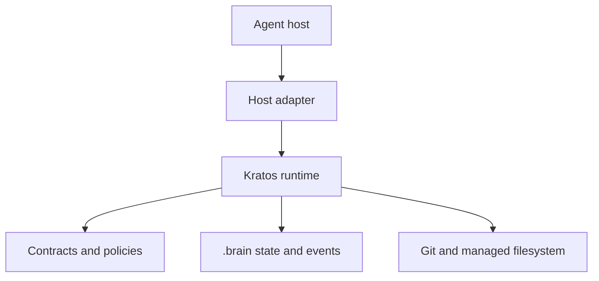
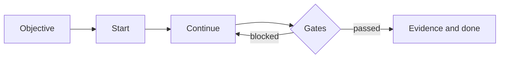

# Kratos

> A deterministic, observable Spec-Driven Development harness for AI coding agents.

**Agents propose. Kratos decides. The event log proves.**

Kratos wraps AI-assisted development in a deterministic runtime. It keeps
project-owned state, validates transitions, records evidence, protects managed
files with atomic transactions, and exposes the same decision contract to
Claude Code, OpenAI Codex, and future host adapters.

## Current status

Kratos is an experimental development snapshot, not a production release. This
snapshot contains the foundation reconstructed from the public Mestre Yoda
issue history plus Kratos implementations for the source-controlled open
engineering work. Every open and closed issue is tracked, but an issue is not
called accepted until its required executable or external evidence exists. The
snapshot remains experimental until the parity, host E2E, release, and
public-pilot gates have produced evidence.

Available foundations include:

- strict TypeScript workspace and deterministic build;
- versioned contracts, schemas, reason codes, and structured results;
- command routing and machine/human output;
- project discovery and `.brain` configuration;
- atomic filesystem transactions and crash-recovery markers;
- append-only event history with a cryptographic hash chain;
- concurrency locks, recoverable leases, and Git state classification;
- idempotent project initialization and stack profiling;
- objective lifecycle and the event-sourced `start`/`continue` state machine;
- deterministic gates, content-bound approvals, evidence, handoff, and done;
- read-only status, statistics, budgets, doctor, and reason explanation;
- dry-run plans and decision explanations;
- host-neutral operation contracts and concrete Codex/Claude Code adapters;
- migration receipts, incremental upgrades, replay audit, safe repair plans,
  evidence bundles, and a script-free local dashboard;
- cross-platform nightly, security, performance, language, package, SBOM,
  checksum, and provenance workflows;
- isolated experimental modules for risk-adaptive profiles, independent judges,
  optional team evidence synchronization, and signed evidence verification.

External validation remains incomplete: real signed-in host E2E runs,
representative public-beta pilots, protected release configuration, and human
graduation approval cannot be proven inside a source snapshot.

## Architecture



The runtime owns decisions. Adapters translate and relay but cannot advance the
workflow by themselves. Domain decisions return effect plans; infrastructure
applies those plans through ports and atomic transaction boundaries.

The embedded ESM runtime keeps project-owned `.brain/` state and bounded
`.claude/` and `.codex/` host surfaces. It carries embedded schemas and performs
validation before domain use.

The [schema registry contract](docs/architecture/schema-registry.md) embeds
registered schemas, validates input before domain use, and emits canonical JSON
at persistence boundaries.

The primary workflow is:



## Toolchain

- Node.js `24.18.0`
- npm `11.16.0`
- TypeScript 6
- Vitest
- esbuild

From a clean checkout:

```bash
npm ci
npm run verify
```

Build the two installable plugins in a temporary directory outside the source
tree:

```bash
npm run build
npm run kratos -- help
npm run package:verify
```

For local linking, initialization, and removal instructions, see
[docs/INSTALLATION.md](docs/INSTALLATION.md).

The complete operator documentation starts at the
[Kratos user guide](docs/user/README.md).

The build produces separate `codex` and `claude-code` packages under
`${KRATOS_BUILD_OUTPUT}` or the operating system temporary directory. The
repository never receives a generated `dist` tree. Each host package embeds the
same runtime and is installed outside the user's project; project
initialization writes only the bounded project-facing surfaces.

## Project state

Kratos keeps durable project state under `.brain/` and may manage bounded
sections of `.claude/`, `.codex/`, `CLAUDE.md`, and `AGENTS.md`. Managed writes
must stay inside the declared transaction surface and preserve user-owned
content outside managed markers.

## Source requirements

Kratos was reconstructed from all open and closed issues in the public
`thiagocorreanet/mestre-yoda` repository as observed on 2026-08-15. Closed
issues are treated as delivered behavior to preserve. Open issues are treated
as requirements with implementation and evidence status tracked separately.

See [KRATOS_BACKLOG.md](KRATOS_BACKLOG.md) for issue-level traceability and
[docs/PROVENANCE.md](docs/PROVENANCE.md) for licensing and derivation details.

## Language and contribution contract

Source code, comments, tests, fixtures, errors, documentation, issues, commits,
and pull requests are written in English. Changes should be contract-first,
test-first, deterministic, and accompanied by reproducible verification.

See the [maturity roadmap](ROADMAP.md), [contribution guide](CONTRIBUTING.md),
and [security policy](SECURITY.md).

Community policies are available in the [Contribution guide](CONTRIBUTING.md),
[Code of Conduct](CODE_OF_CONDUCT.md), [Governance](GOVERNANCE.md),
[Support policy](SUPPORT.md), and [Security policy](SECURITY.md).

## License

MIT. The original copyright and permission notice are preserved in
[LICENSE](LICENSE). See [NOTICE.md](NOTICE.md) for attribution.
