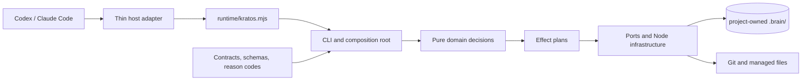
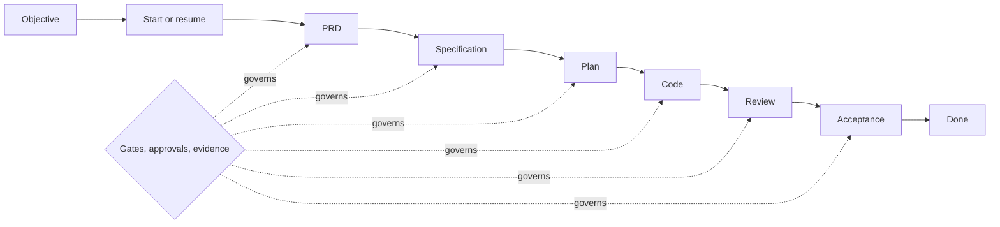

# Kratos HARNESS


> A deterministic, observable development harness for AI coding agents.

**Agents propose. Kratos decides. The event log proves.**

Kratos is an open-source, local-first harness for running Spec-Driven
Development with coding agents. It turns a sequence of model interactions into
a versioned workflow with explicit gates, content-bound approvals, durable
evidence, and recoverable state.

Instead of asking each host to interpret policy, Kratos keeps workflow authority
inside one host-neutral runtime. Claude Code, OpenAI Codex, and future adapters
translate requests and render results; they do not decide whether work may
advance.

> [!WARNING]
> Kratos is an **experimental development snapshot**, not a production release.
> The implementation is substantial, but behavioral parity, signed-in host E2E,
> protected release configuration, and representative public-beta pilots are
> still incomplete. See [Project maturity](#project-maturity).

## Why Kratos exists

AI agents are good at proposing code. A development harness must also answer
harder questions consistently: what was requested, which phase is active, what
evidence exists, whether a gate passed, who approved the exact content, and how
to recover after interruption.

Kratos makes those answers executable:

| Capability | What it provides |
| --- | --- |
| Deterministic workflow | One ordered `prd → spec → plan → code → review → acceptance` state machine |
| Auditable history | Append-only canonical events, hash chaining, replay, and derived snapshots |
| Safe mutation | Previewable effect plans, path allowlists, atomic transaction boundaries, and crash recovery |
| Concurrent operation | Recoverable leases and fencing tokens for project and run scopes |
| Contract-first integration | Versioned schemas, reason codes, results, and host messages |
| Host neutrality | Thin Codex and Claude Code adapters around the same runtime policy |
| Project ownership | Durable project state under a project-owned `.brain/` directory |

The foundation includes versioned contracts, schemas, reason codes, and stable
machine-readable results.

## Architecture in one minute



The runtime is organized around four enforced boundaries:

- **Domain** contains pure decisions, reducers, gates, and policies. It cannot
  import Node.js built-ins or infrastructure.
- **Ports** describe clocks, identifiers, filesystem, Git, locks, input, output,
  and project discovery as explicit dependencies.
- **Infrastructure** implements those ports for Node.js and supplies deterministic
  fakes that share the same contract suites.
- **Composition** collects observations, validates input, dispatches a domain
  decision, and applies the returned plan through managed transactions.

The append-only event stream is authoritative. Snapshots are replay-derived,
approvals and evidence bind content digests, and every public outcome follows a
stable result and reason-code contract. The
[schema registry contract](docs/architecture/schema-registry.md) carries
embedded schemas, performs validation before domain use, and emits canonical
JSON at persistence boundaries.

Persistence uses canonical JSON.

For the complete component, data, security, and runtime analysis, see the
[architecture deep dive](docs/architecture/system-architecture.md) and the
[editable Draw.io map](docs/architecture/system-architecture.drawio).

## The development trail



`objective` establishes the active demand. `start` creates or resumes one run.
`continue` records accepted, rejected, resumed, or terminal transitions against
an expected revision. `done` completes only final acceptance. Duplicate
correlation identifiers are idempotent, while stale revisions, failed gates,
missing evidence, or mismatched runs fail closed with actionable reason codes.

## Repository map

| Path | Responsibility |
| --- | --- |
| `packages/contracts` | Contract identities, compatibility policy, reason catalog, and generated types |
| `packages/runtime` | CLI, deterministic domain, ports, Node/fake infrastructure, and composition |
| `packages/adapters` | Relay-only host protocol and Codex/Claude Code adapter conformance |
| `packages/differential` | Isolated oracle-versus-candidate capture and comparison harness |
| `schemas` / `fixtures` | Closed JSON Schema catalog and contract examples |
| `distribution` | Thin host package assets; the runtime stays plugin-owned |
| `tests` / `quality` | Unit, property, fault, contract, package, differential, and budget evidence |
| `docs` | User guides, ADRs, architecture, compatibility, security, and operations |

The installable artifact is an embedded ESM runtime at `runtime/kratos.mjs`.
The build creates separate Codex and Claude Code packages with the same runtime
and contracts. It does not copy runtime source, TypeScript, `node_modules`, or a
generated `dist` tree into the user's project.

## Getting started as a contributor

Requirements:

- Node.js 24 is the supported runtime major;
- Node.js `24.18.0` within major version 24;
- npm `11.16.0`;
- Git.

Install dependencies and run the repository's canonical verification entry
point:

```bash
npm ci
npm run verify
```

Build the two temporary host packages, inspect the real CLI surface, and verify
the packages:

```bash
npm run build
npm run kratos -- help
npm run package:verify
```

The build writes outside the source tree, under `${KRATOS_BUILD_OUTPUT}` or the
operating-system temporary directory. `verify` passing is a statement about
this workspace, not a release readiness claim: the external validation listed
under [Project maturity](#project-maturity) is what governs promotion.

For local marketplace setup, project initialization, and removal, follow
[Installing Kratos](docs/INSTALLATION.md). The complete operator path starts in
the [Kratos user guide](docs/user/README.md), with an exact
[command reference](docs/user/commands.md).

## Project-owned state

Kratos keeps durable state under `.brain/` and may reconcile bounded sections
of `.claude/` and `.codex/`, plus `CLAUDE.md` and `AGENTS.md`. Managed writes remain
inside the declared transaction surface and preserve user-owned content outside
explicit markers.

The event chain provides tamper evidence, not author authentication. Evidence
classification is metadata, not encryption. Secrets, credentials, raw prompts,
and unrestricted absolute paths do not belong in durable events or public
results. Review the [threat model](docs/security/threat-model.md) before adopting
the harness in a sensitive repository.

## Project maturity

The snapshot contains the core TypeScript runtime, contracts, schemas, command
routing, project discovery and initialization, objective and workflow
lifecycle, gates, approvals, evidence, atomic transactions, event replay,
leases, Git observation, migrations, diagnostics, and local observability.

External validation remains incomplete:

- behavioral parity with the Go v3 predecessor is `0 / 400`;
- in-process coverage of the runtime decision surface is `91%` of statements
  and `86%` of branches, below the `100%` this project intends; 92 of its 121
  measured files are complete, and the shortfall is concentrated in the command
  surface and its composition wiring;
- real signed-in Codex and Claude Code E2E runs are still required;
- public-beta pilots and human graduation approval are not yet available;
- protected release settings, published provenance, and production support are
  not claimed;
- experimental post-1.0 extensions are isolated from the stable command surface.

### Measuring parity

Parity is measured by a Go-to-TypeScript differential harness that runs the
frozen oracle and the fresh candidate under identical inputs, then compares
process outcome, exit code, stream digests, and mutated state after
normalization.

Public self-test available in the committed corpus. Both of its sides run the
same executable, so it proves the harness — capture, normalization, and
comparison — and not Go parity; it does not move the `0 / 400` result above.
The authorized live comparison needs the private frozen oracle and is not part
of this repository. The
[differential harness guide](docs/compatibility/differential-harness.md)
documents both, including how to run them.

Kratos was reconstructed from the public Mestre Yoda issue history observed on
2026-08-15. Closed issues are preserved as required behavior; open issues are
requirements whose implementation and evidence status are tracked separately.
See [KRATOS_BACKLOG.md](KRATOS_BACKLOG.md) for issue-level traceability,
[docs/PROVENANCE.md](docs/PROVENANCE.md) for derivation and licensing, and the
[maturity roadmap](ROADMAP.md) for evidence-based promotion gates.

## Documentation

- [Kratos Wiki](wiki/Home.md) — guided, cross-linked documentation for users, operators, and contributors.
- [User guide](docs/user/README.md) — concepts, quickstart, commands, hosts, and recovery.
- [Architecture deep dive](docs/architecture/system-architecture.md) — components, flows, rules, risks, and evidence.
- [Architecture Decision Records](docs/adr/README.md) — event sourcing, embedded runtime, local state, and host neutrality.
- [Compatibility model](docs/compatibility/contract-versioning.md) — contract families, evolution, and migration boundaries.
- [Distribution contract](docs/compatibility/runtime-distribution.md) — package layout, integrity, and runtime ownership.
- [Security model](docs/security/threat-model.md) — trust boundaries and known limitations.
- [contribution guide](CONTRIBUTING.md) — setup, DCO, provenance, tests, and pull requests.

## Contributing

Kratos is built contract-first, test-first, and evidence-first. Source code,
comments, tests, fixtures, errors, documentation, issues, commits, and pull
requests use English. Contributions require DCO sign-off and clear
intellectual-property provenance.

Start with the [Contribution guide](CONTRIBUTING.md) and the
[contribution workflow](docs/contributing/workflow.md). Community and project
policies are published in the [Code of Conduct](CODE_OF_CONDUCT.md),
[Governance](GOVERNANCE.md), [Support policy](SUPPORT.md), and
[Security policy](SECURITY.md). For vulnerabilities, follow the confidential
reporting path in the [security policy](SECURITY.md).

## Contributors

Thanks to everyone who has contributed to Kratos.

<a href="https://github.com/thiagocorreanet/kratos-harness/graphs/contributors">
  
</a>

## License

Kratos is available under the MIT [LICENSE](LICENSE). Original notices and
attribution are preserved in [NOTICE.md](NOTICE.md).
