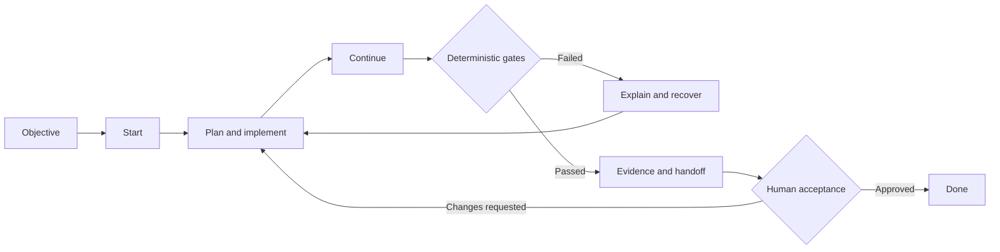

# Mestre Yoda

<p align="center">
  
</p>

> **A deterministic, observable Spec-Driven Development harness for AI coding agents.**

**The model proposes. The runtime decides. The event log proves.**

[](#project-status)
[](LICENSE)
[](#contributing)

Mestre Yoda is an open-source **Spec-Driven Development (SDD) harness** designed to make AI-assisted software delivery more reliable, explainable, and auditable.

Instead of trusting an AI coding agent to remember every rule, infer every gate, and declare its own work complete, Mestre Yoda places a deterministic runtime around the development workflow. Agents can propose actions, but the harness validates state, enforces policies, records evidence, requires human approval where necessary, and explains why work may or may not continue.

The project is being built for **Claude Code** and **OpenAI Codex**, with a host-neutral core designed to support additional coding agents in the future.

## Project status

> [!IMPORTANT]
> Mestre Yoda is currently an **experimental rewrite under active development**. The architecture and public implementation backlog are available, but the new TypeScript runtime is not ready for production installation yet.

This repository is intentionally public from the beginning so that its architecture, compatibility decisions, tests, and trade-offs can evolve in the open.

| Area | Status |
| --- | --- |
| Architecture and implementation backlog | Available |
| Go compatibility baseline | Planned |
| TypeScript deterministic runtime | [Foundation available](docs/development/toolchain.md) |
| Claude Code integration | Planned |
| OpenAI Codex integration | Planned |
| Legacy project migration | Planned |
| Public beta distribution | Planned |

Follow the [public milestones](https://github.com/thiagocorreanet/mestre-yoda/milestones) or browse the [complete implementation backlog](https://github.com/thiagocorreanet/mestre-yoda/issues).

## Why Mestre Yoda exists

AI coding agents are powerful, but a prompt alone is not a reliable control system.

Long-running engineering work introduces problems that conversational memory cannot solve consistently:

- requirements drift as context grows;
- agents may skip validation or interpret policies differently;
- approvals can become stale after artifacts change;
- failures often report what happened without explaining why;
- multiple agents can race against the same project state;
- plugin and runtime versions can drift when distributed separately;
- completion claims may not be backed by reproducible evidence.

Mestre Yoda addresses these problems with a robust SDD workflow in which state transitions, gates, approvals, migrations, and recovery rules are enforced by software rather than left entirely to model behavior.

## Core principles

### Deterministic decisions

The same validated state and inputs should produce the same runtime decision. Language models help reason and propose; they do not silently redefine workflow policy.

### Observable by design

Important decisions become structured events connected to their evidence, artifacts, policies, approvals, and recovery paths.

### Human-controlled delivery

Critical approvals are explicit and bound to the content that was actually reviewed. Changed content invalidates stale authorization.

### Local-first project state

Project-specific state lives inside the project under `.brain/`. Host instructions live in `.claude/` and `.codex/`. The runtime remains owned by the installed plugin.

### No global Yoda binary

The new runtime is developed in TypeScript and distributed as a self-contained JavaScript ESM bundle inside the plugin. This avoids a separately installed global binary, PATH problems, and runtime/plugin version drift.

### Evidence before completion

A workflow is not complete because an agent says it is complete. Required tests, gates, evidence, handoff information, and human acceptance must agree with the current state.

## How the SDD trail works

Mestre Yoda follows one agent-driven trail from intent to accepted delivery:



The runtime is expected to support the primary trail operations `objective`, `start`, `continue`, and `done`, together with operational capabilities such as `status`, `doctor`, `explain`, `evidence`, `handoff`, `stats`, and `budgets`.

Manual phase jumping is not part of the design. The runtime determines which transition is valid from the current state and explains any blocked transition.

## Architecture

Mestre Yoda separates the portable decision engine from host-specific integration and project-specific state.

The canonical [Yoda Observable Architecture Specification](docs/superpowers/specs/2026-08-06-yoda-observable-architecture-design.md) defines the runtime, state, security, migration, testing, and rollout contracts. Structural choices and their consequences are indexed in the [Architecture Decision Records](docs/adr/README.md), and the required end-to-end architecture trace is recorded in [verification evidence](docs/architecture/verification.md).


The central boundary is deliberate:

```text
installed plugin/
├── runtime/yoda.mjs       # self-contained deterministic runtime
├── adapters/              # host-specific integration
├── skills/                # agent-facing workflows
├── schemas/               # versioned public contracts
└── templates/             # managed project templates

user project/
├── .brain/                # state, events, evidence, and configuration
├── .claude/               # Claude Code project surface
├── .codex/                # Codex project surface
└── ...                    # the user's application
```

The plugin contains the motor. The project contains only the memory and configuration required for that project.

## Planned capabilities

The implementation backlog covers more than the happy path:

- deterministic workflow state machine and guardrails;
- versioned schemas and stable reason/exit codes;
- universal structured results with actionable recovery;
- append-only event history with a cryptographic hash chain;
- artifact lineage and observed model identity;
- content-bound human approvals;
- universal dry-run plans and decision explanations;
- atomic filesystem transactions and crash recovery;
- concurrency locks, leases, and fencing tokens;
- real Git repository-state classification;
- shadow, warn, and enforce policy modes;
- deterministic replay, integrity audits, and safe repair;
- transactional migration from legacy sibling Brain layouts;
- privacy-reviewed evidence bundles and an offline static dashboard;
- atomic plugin installation, updates, compatibility checks, and rollback.

See the phase epics for the implementation details:

- [Foundation](https://github.com/thiagocorreanet/mestre-yoda/issues/1)
- [Compatibility Contract](https://github.com/thiagocorreanet/mestre-yoda/issues/8)
- [Deterministic Runtime](https://github.com/thiagocorreanet/mestre-yoda/issues/15)
- [SDD Workflow Parity](https://github.com/thiagocorreanet/mestre-yoda/issues/24)
- [Host Integrations](https://github.com/thiagocorreanet/mestre-yoda/issues/34)
- [Migration and Observability](https://github.com/thiagocorreanet/mestre-yoda/issues/40)
- [Quality Campaign](https://github.com/thiagocorreanet/mestre-yoda/issues/48)
- [Public Beta](https://github.com/thiagocorreanet/mestre-yoda/issues/57)
- [Post-1.0 Ideas](https://github.com/thiagocorreanet/mestre-yoda/issues/63)

## Reliability and testing

Mestre Yoda is being designed with the testing discipline expected from conventional production software, extended for agentic workflows.

The planned quality campaign includes:

- unit tests for policies, reducers, schemas, parsers, and reason codes;
- property-based and model-based state-machine tests;
- Go-versus-TypeScript differential compatibility tests;
- golden scenario fixtures and schema contract tests;
- real filesystem and Git integration tests;
- fault injection at atomic transaction boundaries;
- concurrency, lease, and fencing tests;
- security and adversarial input tests;
- black-box tests against the final bundled JavaScript artifact;
- clean installation, update, migration, and rollback tests;
- mutation testing and performance regression budgets;
- native Linux, Windows, and macOS validation;
- Claude Code and Codex contract/E2E tests;
- model-behavior evaluations only where deterministic tests cannot answer the question.

GitHub Actions will separate fast pull-request feedback from broader nightly, compatibility, security, and release campaigns. See [the Actions implementation issue](https://github.com/thiagocorreanet/mestre-yoda/issues/55).

## Failure explanations

Failures should be useful to both humans and agents. Runtime operations are planned around a universal result contract:

```json
{
  "status": "blocked",
  "exitCode": 3,
  "reasonCode": "GATE_EVIDENCE_STALE",
  "summary": "Required evidence no longer matches the current artifact.",
  "why": [
    "The approved artifact hash differs from the current artifact hash."
  ],
  "evidence": [],
  "stateChanged": false,
  "retryable": true,
  "recovery": "Regenerate the evidence and request approval for the current artifact."
}
```

The final catalog and schemas will be defined through the [compatibility contract](https://github.com/thiagocorreanet/mestre-yoda/issues/11).

## Roadmap

Development is organized into explicit maturity stages:

1. **Experimental** — architecture, compatibility contract, and runtime foundation.
2. **Preview** — complete local SDD trail with initial host integrations.
3. **Beta** — migration, observability, platform coverage, documentation, and public pilots.
4. **Stable** — mandatory parity, security, migration, host, and pilot criteria are satisfied.

The frozen Go implementation will not be retired merely because the rewrite appears feature-complete. Retirement requires measurable compatibility, migration, native platform, host E2E, recovery, and pilot evidence.

## Development

The repository now provides a pinned Node/npm workspace, strict TypeScript
validation, tests with coverage, and a standalone bundle smoke check. Follow the
[deterministic toolchain guide](docs/development/toolchain.md) to reproduce the
complete validation sequence from a clean checkout.

## Contributing

Mestre Yoda is being developed in the open, and thoughtful contributions are welcome.

The project is still establishing its foundation. The best way to participate today is to:

1. Read the relevant [epic and implementation issues](https://github.com/thiagocorreanet/mestre-yoda/issues).
2. Join an existing design or compatibility discussion before implementing a public contract.
3. Keep changes focused on one issue and include reproducible test evidence.
4. Preserve deterministic behavior and document compatibility, state, migration, and security impact.
5. Use English for source code, comments, tests, fixtures, errors, documentation, issues, commits, and pull requests.

Contribution guidelines, governance, the code of conduct, and the security policy are tracked in [the open-source foundation issue](https://github.com/thiagocorreanet/mestre-yoda/issues/4).

The planned development flow uses short-lived `feature/*`, `fix/*`, `docs/*`, and `refactor/*` branches targeting `developer`. Approved release changes then move from `developer` to the protected `main` branch. This policy is tracked in [issue #60](https://github.com/thiagocorreanet/mestre-yoda/issues/60).

## Security

Please do not publish suspected vulnerabilities, secrets, or exploit details in a public issue. A private disclosure process will be published as part of the repository foundation. Until that policy is available, avoid sharing sensitive vulnerability details in this repository.

Security policy implementation is tracked in [issue #4](https://github.com/thiagocorreanet/mestre-yoda/issues/4).

## Frequently asked questions

### Is Mestre Yoda ready to install?

Not yet. This repository currently contains the public design and implementation backlog for the new architecture. Installation instructions will be published only after they are tested against release artifacts.

### Is this just a prompt collection?

No. Skills and prompts guide agent behavior, but deterministic state transitions, gates, validation, concurrency, migrations, and recovery belong to the runtime.

### Why TypeScript and JavaScript instead of Go?

TypeScript provides a productive development model while a bundled JavaScript runtime can ship inside the plugin. The goal is to remove the separately updated global binary without sacrificing deterministic behavior or testability.

### Will Mestre Yoda modify my source code automatically?

AI coding agents may propose and perform project work under their own host permissions. Mestre Yoda's role is to control and explain the SDD workflow, validate transitions, preserve evidence, and enforce delivery gates. Exact permissions and managed paths will be documented before release.

### Where does project state live?

The new architecture keeps project-specific state in `.brain/` inside the project. Host-specific project instructions live in `.claude/` and `.codex/`. The runtime stays inside the installed plugin.

## License

Mestre Yoda is available under the [MIT License](LICENSE).

Before legacy implementation material is introduced, its provenance and right to be published under MIT must be verified. The rewrite is designed to make those decisions explicit and auditable.

---

If reliable, explainable AI-assisted software delivery matters to you, watch the repository, join a design discussion, or help us build the harness in the open.
