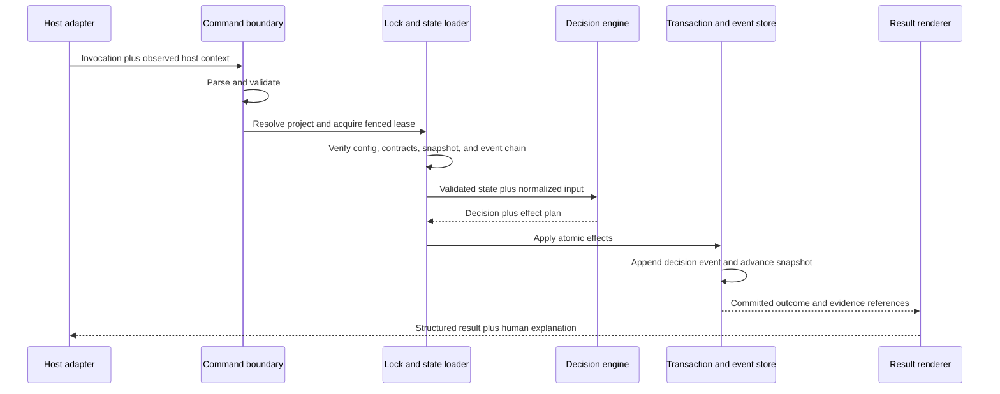
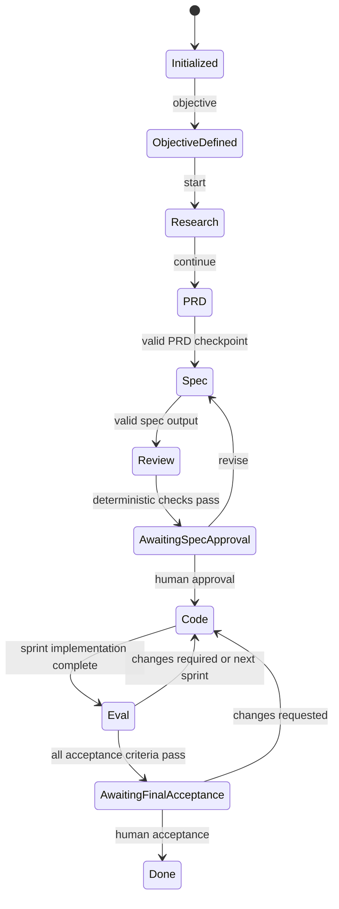

# Yoda Observable Architecture Specification

Status: Approved  
Decision date: 2026-08-06  
Scope: TypeScript rewrite of Mestre Yoda  
Tracking issue: [#2](https://github.com/thiagocorreanet/mestre-yoda/issues/2)

## 1. Purpose and authority

This document is the canonical architecture specification for the Mestre Yoda
rewrite. It defines the product invariants, ownership boundaries, component
model, command and state flow, failure semantics, security posture, test
strategy, migration policy, and rollout constraints that implementation must
preserve.

The frozen Go v3 implementation in `mestre-yoda-old` is the behavioral baseline.
The rewrite may change implementation language, distribution, project-state
placement, observability, and host integration, but it must not silently change
the SDD process. In particular, the PRD process and its machine-readable
contract remain behaviorally equivalent. Any intentional compatibility change
requires a versioned contract, a documented migration, differential evidence,
and maintainer approval.

When sources disagree, authority is resolved in this order:

1. approved architecture decisions and versioned public contracts;
2. this specification;
3. the compatibility inventory and golden fixtures derived from Go v3;
4. implementation details;
5. prompts and generated views.

Prompts may guide work, but they never redefine runtime policy.

## 2. Product principle

> **The model proposes. The runtime decides. The event log proves.**

This motto assigns authority explicitly:

- The model researches, reasons, proposes artifacts, and performs work permitted
  by its host.
- The runtime validates inputs, selects legal transitions, applies policy,
  commits state, and explains blocked work deterministically.
- The event log records what the runtime observed and decided, with enough
  lineage to audit and replay the decision.

The same validated state, configuration, contracts, and inputs must produce the
same decision. A model statement is evidence only when a contract explicitly
accepts it; it is never proof that a deterministic gate passed.

## 3. Non-negotiable behavioral invariants

### 3.1 Single agent-driven trail

The user-facing trail remains agent-driven. Its primary operations are
`objective`, `start`, `continue`, and `done`. Manual phase jumping is not part
of the public workflow. Operational commands such as `status`, `doctor`,
`explain`, `evidence`, `handoff`, `stats`, and `budgets` inspect or support the
trail without becoming alternate transition paths.

The planning and delivery phases remain ordered as follows:

```text
research -> prd -> spec -> review -> code -> eval -> done
```

Every transition is selected by the runtime from persisted state. An agent may
request an operation, but it may not select the next phase directly.

### 3.2 The PRD contract is preserved

The PRD remains the authoritative **WHAT and WHY** artifact. It must not contain
implementation architecture or code. Its process is equivalent to Go v3:

1. Preserve the initial demand verbatim.
2. Classify it as a problem, proposed solution, bug, improvement, refactor, or
   external obligation.
3. Apply adaptive Problem Discovery. Use the 5 Whys when the demand is vague,
   recurring, or solution-first; stop when the probable root cause is clear.
   When the technique is not useful, record the reason instead of fabricating
   five answers.
4. State a probable root cause in terms of a process, system, rule, flow,
   communication, architecture, or context. Never assign personal blame.
5. Separate the validated problem from the proposed solution.
6. Record a solution hypothesis without treating it as an approved design.
7. Define success evidence tied to the validated problem and record the risk
   that the root-cause hypothesis may be wrong.
8. After the problem is clear, apply 5W2H action framing when it adds value.
   Otherwise record why it was skipped.
9. Define the problem, users, goals, non-goals, in-scope and out-of-scope work,
   success metrics, and open questions.
10. Separate blocking questions, which stop the trail, from open questions,
    which the spec phase must resolve explicitly.

The PRD producer emits both the human-readable `00-prd.md` view and a structured
`prd-output.json`. The structured result identifies the producing role,
completion status, next action, feature, written artifacts, discovery outcome,
open questions, and blocking questions. A completed PRD is usable only when its
structured output validates against the versioned schema, reports completion,
and names at least one artifact. Missing or invalid PRD output is a deterministic
checkpoint, not a human gate and not something a model may waive.

Schema version 1 from Go v3 is the compatibility baseline. The compatibility
contract may publish a successor, but it must retain the semantics above and
provide explicit migration and differential fixtures.

### 3.3 Spec, tasks, and acceptance criteria

The spec remains the authoritative **HOW** artifact. It resolves PRD open
questions, describes architecture and contracts, compares trade-offs, and
produces an executable task plan. Tasks are grouped into numbered sprints and
declare affected files, implementation steps, explicit exclusions, and
machine-verifiable acceptance criteria.

Acceptance-criterion identifiers retain the Go v3 shape
`AC-<sprint>.<task>.<number>` and `AC-<sprint>.<task>.E<number>` for edge cases.
They are stable audit identifiers and are never renumbered after approval. Their
canonical status lives in structured state written by the runtime; Markdown
checkboxes are derived views.

### 3.4 Independent review and human authority

The actor that implements work does not judge its own result. Planner, executor,
and judge are distinct roles with observed identity recorded where the host can
provide it. Probabilistic review may contribute evidence, but only deterministic
runtime policy changes workflow state.

Spec approval and final delivery acceptance are always human decisions. Approval
is content-bound: the runtime snapshots canonical hashes of the PRD and spec.
Changing an approved parent artifact invalidates descendants and reopens the
appropriate review and approval path. A stale approval never authorizes changed
content.

The four human gates remain behaviorally equivalent to Go v3:

- `gaps_abertos`: unresolved business gaps require decisions by stable ID;
- `particionamento`: measured scope exceeds configured limits and requires an
  explicit partition decision;
- `aprovacao_spec`: code cannot begin before the current PRD/spec lineage is
  approved;
- `aceitacao_final`: the runtime cannot accept its own delivery.

Other stops are deterministic checkpoints, validation failures, recovery
requirements, or budget controls. They do not become human gates merely because
an agent cannot proceed.

## 4. Ownership and filesystem boundaries

### 4.1 Plugin-owned, immutable-at-runtime assets

The installed, version-coherent plugin owns:

```text
plugin/
├── runtime/yoda.mjs
├── adapters/
│   ├── claude-code/
│   └── codex/
├── skills/
├── schemas/
├── templates/
└── manifest.json
```

- `runtime/yoda.mjs` is one self-contained ESM JavaScript artifact.
- Adapters translate host invocation and response conventions without owning
  workflow policy.
- Skills explain how agents collaborate with the runtime.
- Schemas are versioned public contracts embedded in the bundle.
- Templates generate managed project surfaces.
- The manifest binds plugin, runtime, schema, and template versions.

Runtime execution must not require a global `yoda` binary, a project-local
`node_modules`, TypeScript sources, or network access.

### 4.2 Project-owned state and integration surfaces

The user project owns:

```text
project/
├── .brain/
│   ├── config/
│   ├── features/
│   ├── runs/
│   │   └── <run-id>/
│   │       ├── state.json
│   │       ├── events.jsonl
│   │       ├── artifacts/
│   │       └── transactions/
│   ├── evidence/
│   ├── locks/
│   └── migrations/
├── .claude/
├── .codex/
└── application source
```

- `.brain/` contains project configuration, canonical workflow state, events,
  artifacts, evidence, locks, migration records, and derived views.
- `.claude/` contains only Claude Code project instructions and wiring.
- `.codex/` contains only Codex project instructions and wiring.
- Application source remains owned by the project and is modified only through
  the host's normal permissions plus Yoda's explicit scope policy.

The plugin may update managed project files only through a versioned,
previewable reconciliation operation. It must preserve user-owned content or
fail with a conflict that names the recovery action. Host directories must not
duplicate runtime policy or contain independent state machines.

This in-project `.brain/` boundary intentionally replaces the Go v3 sibling
`<repo>-brain` placement. Migration is explicit and transactional; discovery
alone never moves or rewrites legacy state.

## 5. Runtime components

Each component has one authority and communicates through typed, versioned
interfaces.

| Component | Responsibility | Must not do |
| --- | --- | --- |
| Host adapter | Translate host calls, discover host capabilities, relay structured results | Decide policy or mutate state directly |
| Command parser | Parse and validate command syntax and inputs | Read project state or perform effects |
| Project locator | Resolve the repository root and managed paths safely | Follow untrusted paths outside the project boundary |
| Contract registry | Load embedded schemas and compatibility versions | Infer contracts from prose |
| State loader | Verify configuration, snapshots, event integrity, and migrations | Repair corruption silently |
| Decision engine | Produce a pure decision from validated inputs and state | Perform filesystem, Git, network, or host effects |
| Effect planner | Convert a decision into an ordered, previewable effect plan | Commit partial effects |
| Transaction manager | Apply filesystem changes atomically and recover interrupted work | Hide incomplete transactions |
| Event store | Append canonical, hash-linked events and rebuild derived state | Rewrite accepted history in place |
| Git service | Classify repository state and calculate approved scope deltas | Shell-interpolate untrusted values |
| Lock service | Serialize mutations with leases and fencing tokens | Treat an expired owner as authoritative |
| Output renderer | Render one universal structured result and localized prose | Change the underlying reason or recovery semantics |

The decision engine and reducers are portable and host-neutral. Every host
adapter must pass the same conformance suite.

## 6. Command flow

All mutating operations follow the same order:



Read-only operations use the same validation boundary but do not acquire a
write lease unless they materialize an artifact. Dry-run returns the exact
ordered effect plan without committing state. If validation fails before a
decision, no state changes. If a process stops during commit, a durable
transaction marker makes the next invocation recover or roll back deterministically.

The persisted event records normalized inputs, contract and policy versions,
prior state identity, decision and reason code, effect summary, artifact hashes,
observed host/model identity when available, and resulting state identity. It
references evidence by digest instead of duplicating sensitive content.

## 7. State and transition model

### 7.1 Sources of truth

The append-only event stream is the authoritative history. `state.json` is a
validated snapshot derived from that stream for fast startup. Markdown status,
task checkboxes, dashboards, and summaries are regenerable views. A snapshot
that cannot be reconciled with its event cursor and hash is rejected and must be
rebuilt through an explicit audit or repair operation.

### 7.2 Lifecycle



Business-gap and partition gates may pause planning before spec approval. Budget,
integrity, migration, lock, or recovery conditions may block any operation at
their defined boundary. The runtime records the current gate or checkpoint and
requires an exact matching operation; an unrelated `--gate` token is rejected.

Objective declaration is idempotent for identical text. Replacing a different
objective requires an explicit replace operation that preserves the former
objective in append-only history before writing the new value.

### 7.3 Lineage and invalidation

Canonical JSON is hashed so whitespace and object-key order do not create false
drift. Approval records bind the PRD hash, spec hash, policy version, approver,
and timestamp. A changed or missing parent artifact creates lineage drift and
invalidates the approval and affected descendants. Repair never fabricates an
old hash or suppresses drift.

## 8. Error and result semantics

Every command returns one structured result shape with:

- status and process exit code;
- stable reason code;
- concise summary and ordered explanation;
- evidence references;
- whether state changed;
- whether retry is safe;
- one actionable recovery instruction.

Success, deterministic blocking, invalid invocation, contract failure,
operational failure, integrity failure, and internal defect remain distinct.
Human-readable text may be localized later, but scripts match only the stable
structured fields. Unknown state, contract versions, policy modes, or corrupted
managed files fail closed inside an initialized Yoda project. Outside a Yoda
project, integrations remain inert unless the user explicitly invokes an
initialization command.

Exact reason-code and exit-code catalogs are owned by the Compatibility Contract
milestone. Until that contract is approved, implementations must preserve the
observable Go v3 distinctions and must not publish new stable values ad hoc.

## 9. Security model

### 9.1 Trust boundaries

Project files, Git metadata, host payloads, model output, migrated legacy data,
and environment variables are untrusted inputs. Embedded schemas and the
verified plugin bundle are trusted only for the installed version recorded in
the plugin manifest. Human approval proves authorization for specific content;
it does not prove that the content is safe or correct.

### 9.2 Required controls

- Confine managed paths to the resolved project root and reject symlink,
  traversal, special-file, and case-collision attacks.
- Parse commands without shell interpolation and pass arguments as data.
- Use atomic writes, durable transaction markers, lock leases, and fencing
  tokens for all state mutations.
- Validate every external and persisted object against a versioned schema before
  using it in a decision.
- Default to no telemetry and no network dependency at runtime.
- Exclude secrets, raw prompts, source contents, and sensitive absolute paths
  from events and evidence unless an explicit, reviewed contract requires them.
- Treat the hash chain as tamper evidence, not as identity or authenticity.
- Keep GitHub Actions read-only by default, fork-safe, time-bounded, and pinned
  to immutable third-party action revisions.
- Verify plugin artifacts, checksums, provenance, compatibility, and rollback
  before an update becomes authoritative.
- Record observed host and model identity when available; never claim stronger
  identity evidence than the host supplies.

Security-sensitive failures preserve minimal diagnostics and a safe recovery
path without echoing the rejected secret or payload.

## 10. Testing architecture

Testing is layered so probabilistic evaluation is never used where deterministic
evidence can answer the question.

| Layer | Primary evidence |
| --- | --- |
| Pure unit | Policies, reducers, parsers, reason codes, canonical hashing |
| Contract | JSON Schemas, public result shapes, host adapter protocol |
| Property and model based | State-machine invariants and transition sequences |
| Compatibility | Go v3 versus TypeScript differential results and golden scenarios |
| Filesystem and Git integration | Real repositories, path safety, atomicity, ignored files |
| Fault and concurrency | Crash points, lock expiry, fencing, replay, recovery |
| Security | Malformed inputs, traversal, symlinks, injection, secret redaction, supply chain |
| Bundle black box | Final `yoda.mjs` without repository dependencies or `node_modules` |
| Platform | Native Linux, Windows, and macOS across the supported Node policy |
| Host conformance | Identical Claude Code and Codex decisions for shared scenarios |
| Migration | Discovery, preview, byte-level backup, conversion, rollback, idempotence |
| Behavioral evaluation | Model behavior only where deterministic tests cannot decide |

PR validation stays fast and cancels superseded commits. Nightly, compatibility,
security, platform, and release workflows run deeper campaigns with bounded
artifact retention and minimal reproduction evidence.

Documentation changes run Markdown lint and link validation. Architecture
changes additionally run a manual trace from host invocation through runtime
decision, persisted event, and user response.

## 11. Migration from Go v3

Migration is a user-invoked transaction, never a side effect of discovery:

1. Detect the legacy sibling `<repo>-brain/.brain/` and classify its version
   without writing either repository.
2. Produce a migration plan listing source, destination, contract upgrades,
   conflicts, sensitive data handling, and rollback location.
3. Require explicit human authorization for that exact plan.
4. Lock both migration boundaries, create a verifiable backup, and stage the
   in-project `.brain/` tree.
5. Upgrade contracts incrementally, preserving original artifacts and provenance.
6. Replay and validate state, event, lineage, and acceptance-criterion semantics.
7. Atomically publish the destination or restore the original state.
8. Record a migration receipt and leave the legacy source untouched until the
   user separately confirms retirement.

The PRD process receives dedicated differential fixtures covering discovery,
5 Whys applied and skipped, 5W2H applied and skipped, blocking questions, open
questions, invalid structured output, lineage drift, spec revision, and approval.
No Go runtime is retired until mandatory parity, native platform, migration,
host E2E, recovery, security, and pilot criteria all pass.

## 12. Rollout and policy modes

Maturity progresses through explicit evidence stages:

1. **Experimental:** architecture, contracts, deterministic core, and local
   developer fixtures.
2. **Preview:** complete local SDD trail, initial host adapters, migration dry
   runs, and opt-in users.
3. **Beta:** native platform coverage, observability, public documentation,
   release provenance, rollback rehearsals, and representative pilots.
4. **Stable:** all mandatory compatibility rows and graduation criteria pass,
   with no unresolved critical security, migration, recovery, or host defects.

Policy enforcement may progress through `shadow`, `warn`, and `enforce` modes.
The selected mode is explicit, versioned, evented, and snapshotted at run start.
Changing project defaults does not rewrite the policy of an in-flight run unless
a versioned transition explicitly permits it.

## 13. GitHub Actions architecture

Automation is introduced in dependency order:

1. **Documentation foundation:** Markdown lint and link validation for the
   architecture and open-source documents. This workflow is safe to add before
   the TypeScript workspace exists.
2. **Pull-request CI:** after the deterministic toolchain is committed, run
   install, format check, lint, type check, unit tests, schema checks, build,
   bundle smoke tests, and package-content validation on PRs targeting
   `developer` and `main`.
3. **Quality campaigns:** add native platform, security, nightly stress,
   Go-compatibility, host, and expanded documentation workflows when their test
   suites exist.
4. **Release gates:** build from clean source, verify mandatory checks, create
   reproducible packages, checksums, SBOM, and provenance, then rehearse rollback.

All workflows use standard public-repository runners unless a separately
approved need proves otherwise. They set explicit least privileges, immutable
action revisions, timeouts, concurrency behavior, fork-safe execution, and
short-lived diagnostic artifacts. A workflow must not pretend to test a layer
whose source or fixtures do not yet exist.

## 14. Milestone traceability

Every public milestone maps to named architecture sections:

| Milestone | Sections that govern it |
| --- | --- |
| 1. Foundation | 1–5, 8–10, 13 |
| 2. Compatibility Contract | 1, 3, 7–8, 10–11 |
| 3. Deterministic Runtime | 5–10 |
| 4. SDD Workflow Parity | 3, 6–8, 10 |
| 5. Host Integrations | 4–6, 9–10 |
| 6. Migration and Observability | 6–7, 9–12 |
| 7. Quality Campaign | 9–10, 13 |
| 8. Public Beta | 9, 11–13 |
| 9. Post-1.0 Ideas | 15 |

Implementation issues must link their changed behavior to one or more of these
sections and to the ADR that owns any structural decision.

## 15. Post-1.0 boundary

The first stable release excludes adaptive rigor profiles, independent dual
model judges, a remote team Control Tower, and signed remote evidence
attestations. These remain design candidates only after public-beta evidence.

Any post-1.0 extension must remain optional, versioned, auditable, removable,
and subordinate to the local deterministic runtime. It must not require an
account or service for core operation, upload source or prompts by default,
allow probabilistic judges to mutate state, silently weaken mandatory policy,
or turn a remote server into the authority for local transitions.

## 16. Decision summary

The selected architecture uses a host-neutral deterministic TypeScript core,
distributed as one embedded ESM JavaScript runtime, with project-local state and
an append-only event history. Claude Code and Codex integrate through thin
adapters and a shared conformance contract. The Go v3 SDD process—especially
PRD discovery, structured output, lineage, independent review, and human
approval—remains the compatibility baseline. Distribution and observability
change; workflow meaning does not.
