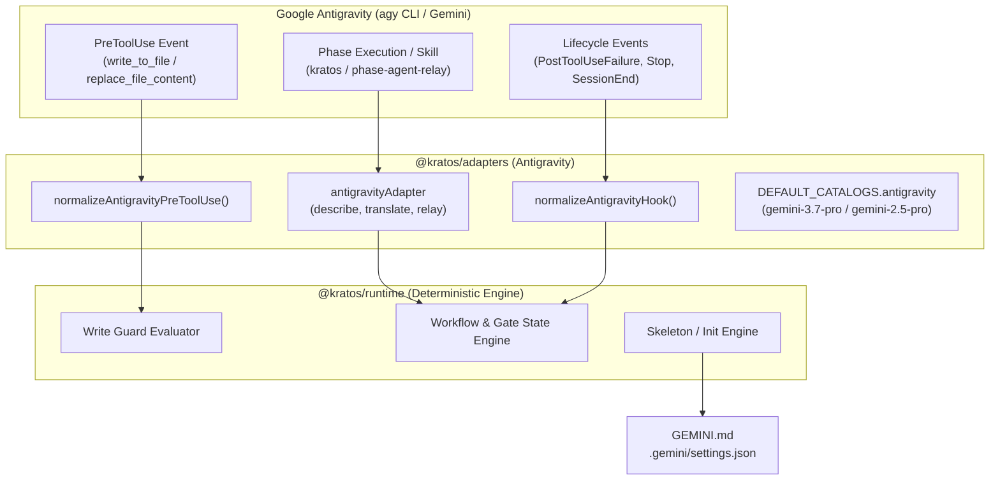

# Google Antigravity (`agy` / Gemini) Host Adapter Design

## Outcome

Kratos can run under Google Antigravity (`agy` CLI) and Gemini models as a first-class host adapter, with full parity to the existing Claude Code and OpenAI Codex integrations.

## Architecture and System Context

Kratos is designed to be host-neutral: AI agents propose actions, the Kratos deterministic runtime evaluates and authorizes or refuses them, and the append-only event stream records the result.

The Google Antigravity host integration introduces:

1. **Contract Schemas (`schemas/` and `@kratos/contracts`)**: Extension of host unions and model catalog types to include `"antigravity"`.
2. **Host Adapter (`@kratos/adapters`)**: Relay-only `antigravityAdapter` implementing the 3-method interface (`describe`, `translate`, `relay`), pre-tool mutation normalization for Antigravity's `write_to_file` and `replace_file_content` tools, and default model catalog routing for Gemini models.
3. **Runtime & CLI (`@kratos/runtime`)**: Support for `--host antigravity` during project initialization (`kratos init`), workspace surface generation (`GEMINI.md` and `.gemini/settings.json`), and launcher host resolution in workflow orchestration.
4. **Distribution (`distribution/antigravity/` and `scripts/`)**: On-demand skill definition (`SKILL.md`), phase agent relay (`phase-agent-relay.mjs`), lifecycle hooks configuration (`hooks.json`), and packaging into distribution bundles.



---

## Detailed Component Specifications

### 1. Contract Schemas & Types

#### Schemas (`schemas/`)

- `schemas/host/adapter-message.v1.1.schema.json`:
  - `properties.host.enum`: `["claude", "codex", "antigravity"]`
- `schemas/host/phase-handoff.v1.1.schema.json`:
  - `properties.host.enum`: `["claude", "codex", "antigravity"]`
- `schemas/host/init-answers.v1.2.schema.json` & `schemas/host/init-answers.v1.3.schema.json`:
  - `properties.hosts.items.enum`: `["claude", "codex", "antigravity"]`
  - `properties.modelRoles.properties`: add `"antigravity": { "$ref": "#/$defs/roleMap" }`
- `schemas/state/project-config.v1.2.schema.json` & `schemas/state/project-config.v1.3.schema.json`:
  - `properties.modelRoles.properties`: add `"antigravity": { "$ref": "#/$defs/roleMap" }`

#### Generated Contracts (`packages/contracts`)

- `SupportedHost`: `"claude-code" | "codex" | "antigravity"`
- Host model routing and catalog types accept `"antigravity"` as a valid configuration host identifier.

---

### 2. Host Adapter (`packages/adapters`)

#### Model Routing & Catalog (`packages/adapters/src/index.ts`)

`DEFAULT_CATALOGS.antigravity` specifies:

```typescript
antigravity: frozenCatalog({
  host: "antigravity",
  defaults: {
    planner: { model: "gemini-3.7-pro", effort: "medium" },
    implementer: { model: "gemini-3.7-pro", effort: "high" },
    judge: { model: "gemini-2.5-pro", effort: "high" },
  },
  models: [
    {
      canonicalModel: "gemini-3.7-pro",
      aliases: ["gemini-3.7-pro", "gemini-3.7"],
      efforts: ["low", "medium", "high"],
    },
    {
      canonicalModel: "gemini-3.7-flash",
      aliases: ["gemini-3.7-flash"],
      efforts: ["low", "medium", "high"],
    },
    {
      canonicalModel: "gemini-2.5-pro",
      aliases: ["gemini-2.5-pro", "gemini-2.5"],
      efforts: ["low", "medium", "high"],
    },
  ],
})
```

Implementer and judge canonical models remain strictly distinct (`gemini-3.7-pro` vs `gemini-2.5-pro`).

#### Pre-Tool Use Normalization (`packages/adapters/src/antigravity/pre-tool-use.ts`)

- **Recognized Mutation Tools**:
  - `write_to_file`:
    - Payload fields: `TargetFile` (non-empty absolute path string), `CodeContent` (string), `Description` (string), `Overwrite` (optional boolean).
    - Mutation kind: If `Overwrite === true`, normalized as `{ kind: "update", path: TargetFile }`. Otherwise, normalized as `{ kind: "create", path: TargetFile }`.
  - `replace_file_content`:
    - Payload fields: `TargetFile` (non-empty absolute path string), `TargetContent` (string), `ReplacementContent` (string), `Instruction` (string), `Description` (string), `StartLine` (integer >= 1), `EndLine` (integer >= StartLine), `AllowMultiple` (optional boolean).
    - Mutation kind: `{ kind: "update", path: TargetFile }`.
- **Non-mutating Tools**:
  - `view_file`, `list_dir`, `grep_search`, `find_by_name`, `read_url_content`, `run_command`, `ask_question`, `send_message`, `manage_task`, `schedule`, `invoke_subagent`, `define_subagent`, `manage_subagents` -> return `{ kind: "pass" }`.
- **Malformed Payloads**:
  - Any missing required fields, non-absolute `TargetFile`, invalid line numbers, or unrecognized mutation shapes on recognized mutation tools fail closed with `{ kind: "guard", request: uninspectablePreToolRequest() }`.

#### Lifecycle Hooks (`packages/adapters/src/hooks.ts`)

- `normalizeAntigravityHook(kind: HookKind, input: unknown): HookObservationV1 | null`
  - For `tool.before`, uses `normalizeAntigravityPreToolUse(input)` to extract mutations.
  - For `tool.failed`, normalizes tool exit codes, tool family, error diagnostic, and token usage.
  - For `session.sample` and `session.end`, normalizes session ID, timestamp, and cumulative gross tokens.

#### Adapter Instance (`packages/adapters/src/index.ts`)

- `configurationHostFor(host: SupportedHost)`: returns `"antigravity"` when `host === "antigravity"`.
- `antigravityAdapter(options: HostAdapterOptions): HostAdapter` adheres to the strict 3-method interface:
  - `describe()`: returns `HostDescriptor` with `configurationHost: "antigravity"`.
  - `translate(invocation: HostInvocation)`: produces `AdapterMessageV1_1`.
  - `relay(response: AdapterMessageV1_1)`: produces `HostRendering` (`{ stdout, stderr, exitCode }`).

---

### 3. Runtime and CLI (`packages/runtime`)

#### Commands & Domain Configuration

- `packages/runtime/src/domain/cli/adapters.ts`:
  - `SupportedHost`: `"claude-code" | "codex" | "antigravity"`
  - `HOSTS`: `["claude-code", "codex", "antigravity"]`
- `packages/runtime/src/domain/init/answers.ts`:
  - `HOSTS`: `["claude", "codex", "antigravity"]`
  - `type Host`: `"claude" | "codex" | "antigravity"`
- `packages/runtime/src/domain/init/skeleton.ts`:
  - `HOST_SURFACES` entry for `"antigravity"`:
    - `roots`: `[".gemini", "GEMINI.md"]`
    - `files`:
      - `GEMINI.md`: initialized with delimited Kratos managed instructions section.
      - `.gemini/settings.json`: initialized with `{ permissions: { allow: [], deny: [] } }`.
- `packages/runtime/src/composition/workflow.ts`:
  - `configurationHost(launcherHost)`: resolves `"antigravity"` to `{ kind: "resolved", host: "antigravity" }`.
- `packages/runtime/src/composition/migration.ts`:
  - Recognizes `"antigravity"` during config migrations.

---

### 4. Distribution and Packaging (`distribution/` & `scripts/`)

#### Distribution Files (`distribution/antigravity/`)

- `distribution/shared/hooks.v1.json`:
  - Add matcher `"antigravity": "write_to_file|replace_file_content"` for `tool.before`.
  - Add matcher `"antigravity": ".*"` for `tool.failed`, `session.sample`, and `session.end`.
- `distribution/antigravity/skills/kratos/SKILL.md`:
  - Bridges Antigravity to `node scripts/kratos.mjs` and guides phase agent execution.
- `distribution/antigravity/skills/kratos/scripts/phase-agent-relay.mjs`:
  - Implements `export const host = "antigravity"`.
  - Invokes `relaySelectedPhase("antigravity", ...)` with `defaultModelRouting().observe("antigravity")`.
- `distribution/antigravity/hooks/hooks.json`:
  - Rendered by `scripts/render-hooks.mjs` mapping `PreToolUse`, `PostToolUseFailure`, `Stop`, `SessionEnd`.

#### Build & Tooling (`scripts/`)

- `scripts/build.mjs`:
  - Packages `"antigravity"` in `artifacts` along with `"claude-code"` and `"codex"`.
  - Generates `runtime/manifest.json` with accurate asset digests.
- `scripts/render-hooks.mjs`:
  - Includes `"antigravity"` in static generation.
- `scripts/install-plugin.mjs`:
  - Supports `--host antigravity` for installing into workspace `.agents/` or global `~/.gemini/config/`.

---

## Verification Plan

### Automated Tests

1. `tests/antigravity-pre-tool-relay.test.ts`: Unit tests verifying `write_to_file` (`create` / `update`), `replace_file_content` (`update`), non-mutation passthrough (`pass`), and malformed payload handling (`guard.target_uninspectable`).
2. `tests/host-adapter-contract.test.ts`: Conformance suite running `describeHostAdapterContract("Antigravity", ...)` and checking judge/implementer independence.
3. `tests/support/pre-tool-relay-cases.ts`: Cross-host parity suite asserting identical write guard enforcement across Claude Code, Codex, and Antigravity.
4. `tests/bundle-smoke.test.ts`: Packaging tests ensuring deterministic bundle creation and manifest integrity.
5. Full repository verification: `npm run verify`.
