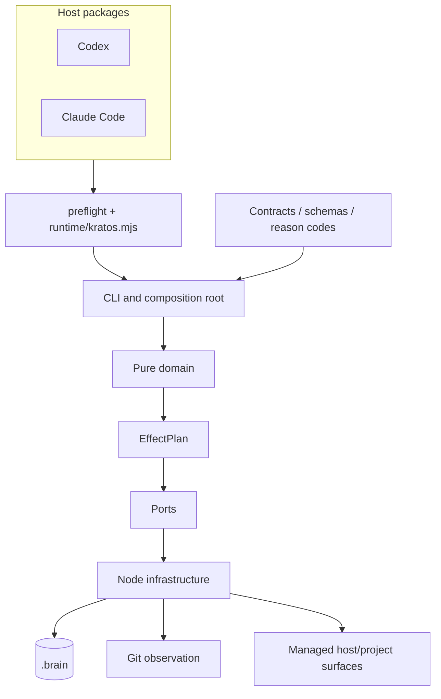

# Architecture

Kratos uses a functional-core, imperative-shell architecture with enforced
dependency direction. Domain decisions are deterministic; clocks, randomness,
filesystem, Git, locks, process state, standard input, and output arrive through
explicit ports.

## System view



## Runtime layers

| Layer | Owns | May depend on |
| --- | --- | --- |
| Entry | Process boot and top-level CLI | Composition |
| Composition | Observation, dependency selection, plan application | Domain, ports, infrastructure, contracts |
| Domain | Decisions, policies, reducers, models, effect plans | Domain, ports, contracts |
| Ports | Capability interfaces | Domain types |
| Infrastructure | Node and deterministic fake implementations | Ports and domain |
| Contracts | Public identities, compatibility, reason policy | No runtime layer |

Architecture tests reject Node built-ins in domain and ports, infrastructure
imports from domain, and non-entry imports of composition.

## Main components

- **CLI and composition:** parses one registry, observes declared prerequisites,
  checks decision/plan consistency, commits, then publishes output.
- **Project discovery:** canonicalizes explicit roots, walks ancestors when
  allowed, understands Git worktrees, and classifies configuration.
- **Objective and workflow:** maintains one active feature and one event-sourced
  run through six ordered phases.
- **Gates, approvals, and evidence:** evaluate observed facts in stable order and
  bind decisions to exact content.
- **Events and snapshots:** seal canonical events and rebuild snapshots from a
  verified history.
- **Transactions and locks:** provide durability, revision protection, recovery,
  concurrency authority, and fencing.
- **Result boundary:** maps stable reason codes to status, exit code,
  retryability, recovery, evidence requirements, and safe rendering.
- **Migration and observability:** plan legacy migration, audit replay, preview
  repair, and generate local evidence views.

## Workspace packages

```text
@kratos/contracts
    ↑             ↑
@kratos/runtime  @kratos/adapters

@kratos/differential → isolated compatibility tooling
```

The source `adapters` package defines and tests the host-neutral relay contract.
Current plugin assembly primarily compiles contracts/runtime and combines them
with thin assets in `distribution/`.

## Persistence model

There is no database or network service in the connected runtime. Project state
is local filesystem data under `.brain/`, protected by schemas, canonical JSON,
hashes, path safety, durable filesystem primitives, and transaction journals.

## Deep references

- [Full architecture report](../docs/architecture/system-architecture.md)
- [Editable multi-page diagram](../docs/architecture/system-architecture.drawio)
- [Runtime boundaries](../docs/architecture/runtime-boundaries.md)
- [Architecture Decision Records](../docs/adr/README.md)
- [Per-file coverage inventory](../docs/architecture/architecture-coverage.csv)
