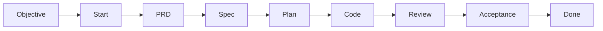

# Development trail

Kratos owns one event-sourced run for the active feature. A host requests an
operation; it cannot select a phase by mutating state or by naming a retired
phase command.

## Lifecycle

The main command sequence is:

1. `objective` records the active demand and deterministic feature identity.
2. `start` creates the first run event or resumes the exact existing run.
3. `evidence record` registers classified, digest-bound evidence.
4. `approve` records a content-bound approval or rejection.
5. `continue` resumes, rejects, or requests completion of the current phase.
6. `done` requests accepted final completion.

Use `status`, `stats`, `budgets`, `doctor`, `explain`, and `handoff` for read-only
orientation.

## Objective rules

- Empty or unnameable objective text is refused.
- The same text is idempotent.
- A divergent active objective requires `--replace`.
- A divergent objective after completion may open a new feature.
- The feature slug derives only from normalized objective text, never from time
  or randomness.

## Start and continue

`start` requires an active objective and a clean worktree. A correlation
identifier represents one delivery attempt; replaying the same operation should
be a no-op. The current source snapshot has a known bug in existing-run start
retry and does not yet pass that focused test.

`continue` requires:

- the active feature and run;
- an exact expected revision;
- a valid action (`resume`, `reject`, or phase completion);
- artifact and evidence references for completion;
- no enforcing gate failures.

A missing artifact, missing evidence, or failed enforcing gate records a
recoverable rejection rather than silently advancing.

## Gate order

Gates are evaluated in stable precedence:

1. context readable;
2. stop-loss state and budget;
3. PRD present;
4. specification approval;
5. gaps closed;
6. partition approval when required;
7. final acceptance.

Modes are `shadow`, `warn`, and `enforce` in the domain model. The currently
connected project policy maps to warn or enforce behavior.

## Approvals and evidence

Approvals bind the run, gate, decision, policy, revision, PRD digest, and spec
digest. Changing bound content invalidates the earlier decision.

Evidence stores a safe reference, SHA-256 digest, kind, classification, and
redaction metadata. It does not copy arbitrary secret content into the event
history and does not encrypt the referenced artifact.

## Completion

Final completion is legal only in acceptance with passing gates, current
content-bound approval, verified evidence, and valid lineage. The accepted event
and replay-derived snapshot are committed as one managed mutation.

See the [command reference](../docs/user/commands.md) and
[workflow architecture](../docs/architecture/workflow-state-machine.md) for the
exact contract.
