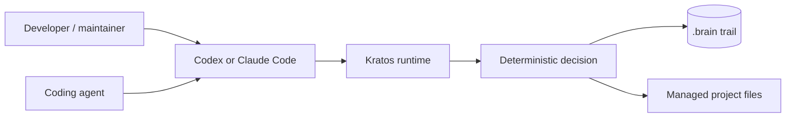

# Kratos Wiki

Kratos is a local-first development harness for teams building software with AI
coding agents. It turns Spec-Driven Development into an executable trail with a
deterministic state machine, versioned contracts, explicit gates, durable
evidence, and recoverable project-owned state.

> **Current status:** Kratos is an experimental development snapshot, not a
> production release. The implementation is broad, while compatibility,
> signed-in host E2E, public pilots, and release graduation remain incomplete.

## The core idea

An agent can propose code, an artifact, or a transition. Kratos decides whether
that operation is valid for the observed project state.

The event history, not chat memory, explains how the run reached its current
state. Host adapters translate and relay; they do not own workflow policy.

## What Kratos provides

- A six-phase trail: PRD, specification, plan, code, review, and acceptance.
- Stable command, host-message, schema, result, and reason-code contracts.
- Content-bound approvals and classified, digest-bound evidence.
- Append-only canonical events and deterministic snapshot replay.
- Atomic managed mutations with persistent journals and crash recovery.
- Recoverable project/run leases with fencing tokens.
- Read-only Git observation and strict project path boundaries.
- The same runtime policy behind Codex and Claude Code surfaces.
- Local audit, doctor, repair preview, evidence bundle, and static dashboard.

## Choose a path

| You want to… | Start here |
| --- | --- |
| Build and inspect Kratos locally | [Getting started](Getting-Started.md) |
| Understand its boundaries | [Architecture](Architecture.md) |
| Learn how a run advances | [Development trail](Development-Trail.md) |
| Understand `.brain`, events, and schemas | [Contracts and state](Contracts-and-State.md) |
| Recover from interrupted work | [Reliability and recovery](Reliability-and-Recovery.md) |
| Review the threat model | [Security model](Security-Model.md) |
| Diagnose an operation | [Operations and troubleshooting](Operations-and-Troubleshooting.md) |
| Submit a contribution | [Contributing and governance](Contributing-and-Governance.md) |
| Check maturity and known gaps | [Project status and roadmap](Project-Status-and-Roadmap.md) |

## Authoritative references

- The [project README](../README.md) is the public landing page.
- The [user guide](../docs/user/README.md) is the operator reference.
- The [architecture report](../docs/architecture/system-architecture.md) maps
  components, flows, business rules, data, risks, and evidence.
- The [Draw.io architecture map](../docs/architecture/system-architecture.drawio)
  is the editable visual model.
- The [coverage inventory](../docs/architecture/architecture-coverage.csv)
  traces the analysis to individual files and symbols.

