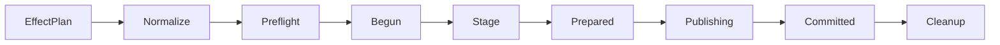

# Reliability and recovery

Kratos treats interruption, retries, and concurrent agents as normal operating
conditions. Reliability is based on explicit state machines rather than best
effort cleanup.

## Managed mutation pipeline



Only managed create, write, and delete effects enter the transaction manager.
Normalization:

- enforces the managed path allowlist;
- detects conflicting parent/child operations;
- creates required parent-directory effects;
- removes already-satisfied operations;
- captures expected and resulting fingerprints.

## Journal and staging

Each transaction owns:

```text
.brain/transactions/<transaction-id>/
├── progress.json
├── progress.next
├── manifest.json
└── staging/
```

Payloads are staged, synced, and checked before publication. The manifest stores
operation metadata and digests, not write contents. `progress.next` is durably
written before replacing `progress.json`.

## Recovery decisions

| Observed phase | Safe decision |
| --- | --- |
| `begun` / `prepared`, nothing published | Abort and clean staging |
| `publishing`, known prefix present | Continue from the next operation |
| All expected results present | Mark committed |
| `committed` / `aborted` with residue | Clean idempotently |
| Unknown bytes, order, or fingerprint | Refuse as `runtime.state_corrupt` |

Another incomplete transaction blocks new mutations with
`runtime.recovery_required`. Recovery requires a content-bound token; it is not
an unauthenticated “force” path.

## Leases and fencing

Kratos supports closed resources:

- `project`;
- `run:<run-id>`.

Leases use owner, lease ID, state revision, expiry, and a monotonic fencing
token. A new ownership epoch advances the token. Renew and release require the
exact still-writable lease identity. Takeover is explicit and only legal after
expiry plus a skew interval.

Immediately before each protected publication, the transaction manager
re-observes durable lease authority. A stale worker cannot publish merely
because it once held a lock.

## Event/transaction relationship

Workflow and lease events are prepared from verified history. The event stream
and its replay-derived snapshot are expanded into one managed transaction with
preconditions on the previously observed pair.

This prevents:

- an event without its snapshot;
- a snapshot without its event;
- publication against a changed stream;
- a stale lease holder winning a race.

## Git reliability

Git observation uses fixed, read-only commands with prompts and ambient config
disabled. Timeouts, command failure, invalid output, non-repository state, and
unreadable paths are typed results rather than thrown control flow.

Evidence stores safe command metadata, lengths, and digests, not raw Git output
that could contain terminal sequences or sensitive path names.

## Operational rule

Do not delete `.brain/transactions` or `.brain/locks` to “unstick” a project.
Run diagnostic and recovery operations so Kratos can preserve and explain the
evidence.

References:

- [Atomic transactions](../docs/architecture/atomic-transactions.md)
- [Concurrency locks](../docs/architecture/concurrency-locks.md)
- [Git service](../docs/architecture/git-service.md)
- [Migration and recovery guide](../docs/user/migration-and-recovery.md)
