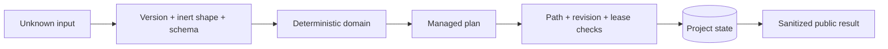

# Security model

Kratos protects a local project boundary. It is not an identity provider,
secret manager, malware sandbox, or remote authorization service.

## Assets

- Project source and user-owned documentation.
- `.brain` workflow history, evidence metadata, approvals, and recovery records.
- Host configuration in `.claude`, `.codex`, `CLAUDE.md`, and `AGENTS.md`.
- Installed plugin runtime, schemas, and package integrity manifests.

## Trust boundaries

Host/model identity is an observed signal. A missing or untrustworthy signal is
recorded as a limitation; Kratos does not invent identity.

## Filesystem safety

Managed operations reject:

- absolute, drive-qualified, traversing, empty, control-character, or
  backslash-bearing project-relative paths;
- symlinks that escape the canonical project root;
- special files and unsafe replacement targets;
- case-insensitive collisions;
- changes outside `.brain`, `.claude`, `.codex`, `AGENTS.md`, and `CLAUDE.md`
  under the closed transaction rules.

Instruction files are modified only inside explicit Kratos markers. Existing
unmarked content requires explicit merge or force authorization.

## Input and output safety

- Unknown structured input crosses contract selection and fail-closed schema
  validation before domain use.
- Proxies, accessors, prototype manipulation, cycles, sparse arrays, and
  unsupported values are rejected.
- Public results reject terminal controls, stack traces, absolute paths, common
  credential patterns, unsafe URLs, and invalid evidence references.
- Unexpected errors become stable internal-failure prose without raw exception
  content.

## Evidence and approvals

Evidence references content by digest and records kind, classification, and
redaction treatment. `restricted` evidence cannot verify with no redaction.

These controls do not encrypt or apply access control to the referenced file.
Teams remain responsible for repository policy, storage encryption, retention,
and which `.brain` content is committed.

Approvals prove that a recorded decision bound particular content, policy, and
revision. They do not prove the real-world identity of the approver beyond the
observed local input.

## Integrity is not authorship

The event hash chain detects an edit unless the chain is recomputed. An actor
with unrestricted write access could rewrite and recompute the entire chain.
Signed evidence and remote attestations remain isolated post-1.0 work.

## Dependency and release security

The repository defines pinned Actions, dependency review, CodeQL, SBOM,
checksums, and provenance workflows. Their presence in the current workspace is
not proof that public release controls are active or that a release has been
published.

## Reporting vulnerabilities

Do not open a public issue for a vulnerability. Follow the confidential path in
the [Security policy](../SECURITY.md).

Deep reference: [Threat model](../docs/security/threat-model.md).

